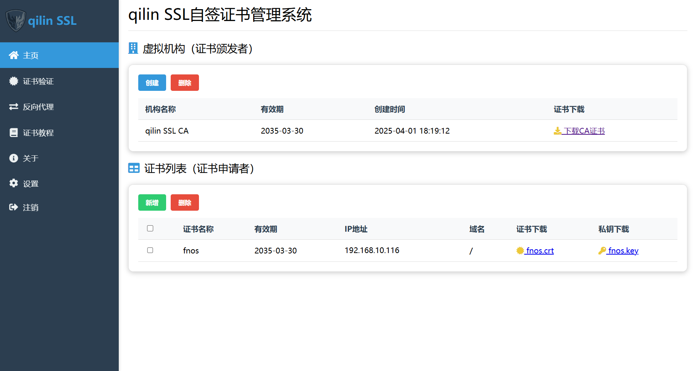

# qilin SSL 自签证书管理系统

<div align="center">
  
  <p>一款易用的自签证书管理系统</p>
  
</div>

## 项目介绍

qilin SSL 是一个基于 Flask 和 OpenSSL 开发的自签证书管理系统，旨在简化 SSL 证书的创建、管理和验证过程。系统提供了直观的 Web 界面，使用户能够轻松创建自签名 CA 证书、签发服务器证书，并配置反向代理服务，无需深入了解复杂的 OpenSSL 命令。

## 主要功能

### 1. 虚拟机构（CA）管理
- 创建自定义虚拟证书颁发机构（CA）
- 支持设置 CA 私钥密码保护
- 查看和下载 CA 证书
- 管理 CA 证书生命周期

### 2. 证书申请与管理
- 基于创建的 CA 签发服务器证书
- 支持多域名和多 IP 地址的 SAN 扩展
- 证书批量管理和删除
- 证书和私钥的安全下载

### 3. 证书验证
- 验证已签发证书的有效性
- 支持上传自定义证书进行验证


### 4. 反向代理服务
- 基于已签发证书配置 HTTPS 反向代理
- 将 HTTP 服务转换为 HTTPS 服务
- 支持多种反向代理配置选项
- 管理反向代理服务的启动和停止


## 安装指南

### 系统要求
- Windows 操作系统（暂时）
- Python 3.6 或更高版本

### 安装步骤
1. 使用exe可执行文件安装

2. 或者克隆或下载项目到本地

3. 安装依赖包
   ```bash
   pip install -r requirements.txt
   ```

4. 运行应用程序
   ```bash
   python app.py
   ```

5. 在浏览器中访问 `http://127.0.0.1:2002`

6. 使用默认账号登录
   - 用户名：admin
   - 密码：admin123

## 使用指南

### 创建虚拟机构（CA）

1. 登录系统后，在主页点击「创建」按钮
2. 填写机构名称（可选）
3. 设置私钥密码（可选，增强安全性）
4. 点击「创建」完成 CA 证书生成
5. 下载 CA 证书并安装到本地受信任的根证书颁发机构

### 申请服务器证书

1. 在主页的「证书列表」区域点击「新增」按钮
2. 填写证书名称
3. 输入需要支持的 IP 地址（多个地址用分号分隔）
4. 输入需要支持的域名（多个域名用分号分隔）
5. 点击「创建」完成证书申请
6. 下载证书和私钥文件

### 配置反向代理

1. 点击侧边栏的「反向代理」菜单
2. 点击「新增」按钮
3. 填写服务名称
4. 输入原始服务地址（如 http://localhost:8080）
5. 输入反向代理后的地址（如 https://example.com）
6. 选择证书类型（qilin SSL 申请的证书或上传自定义证书）
7. 点击「创建」完成反向代理配置

### 验证证书

1. 点击侧边栏的「证书验证」菜单
2. 输入需要验证的 IP 地址或域名
3. 选择证书类型（qilin SSL 申请的证书或上传自定义证书）
4. 点击「验证」按钮查看验证结果

## 安全说明

- 系统生成的 CA 证书和私钥仅用于测试和开发环境
- 在生产环境中，建议使用正规 CA 机构签发的证书
- 请妥善保管 CA 私钥，避免泄露
- 定期更换用户密码，提高系统安全性

## 常见问题

1. **证书不被浏览器信任怎么办？**
   - 需要将生成的 CA 证书安装到操作系统的受信任根证书存储区

2. **如何在移动设备上信任证书？**
   - 将 CA 证书发送到移动设备并在设备设置中安装证书

3. **反向代理服务无法启动？**
   - 检查端口是否被占用
   - 确认证书和私钥文件路径正确

## 社区支持

如有问题或建议，欢迎加入 QQ 群：784295077 进行交流

## 版本信息

当前版本：v1.0.1

## 许可协议

本项目采用 MIT 许可证
